# WhatsApp Agent System Architecture

## Overview

The WhatsApp Agent System consists of two separate FastAPI applications:
1. **Zapa Private** - Internal service handling WhatsApp webhooks and admin functions
2. **Zapa Public** - Internet-facing service for end users to manage their WhatsApp connections

Both applications share a Vue.js + Tailwind CSS frontend and follow the **"Plumbing + Intelligence"** architecture pattern.

## System Architecture

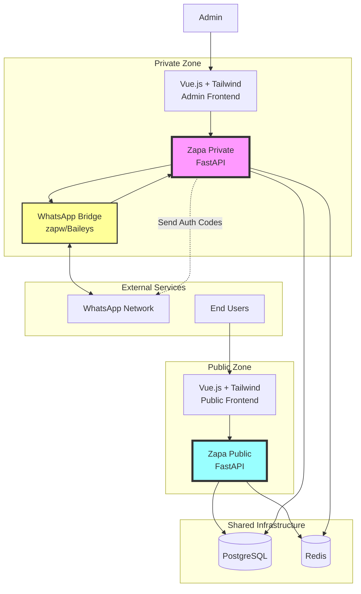

## Component Architecture

### Zapa Private (Internal Service)

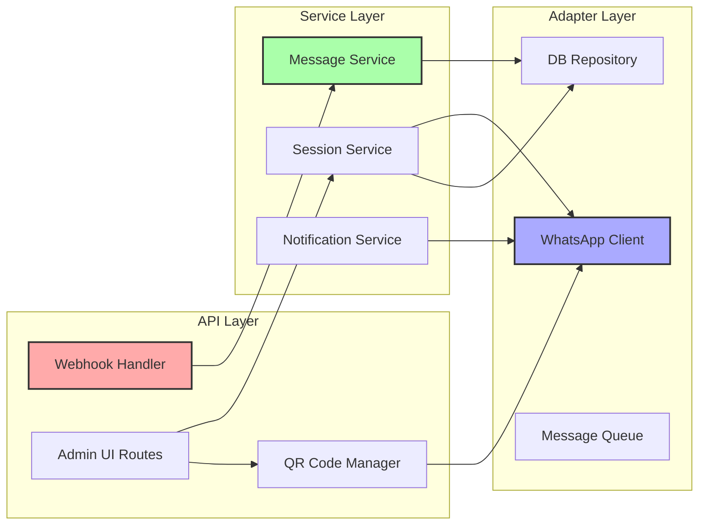

### Zapa Public (Internet-Facing Service)

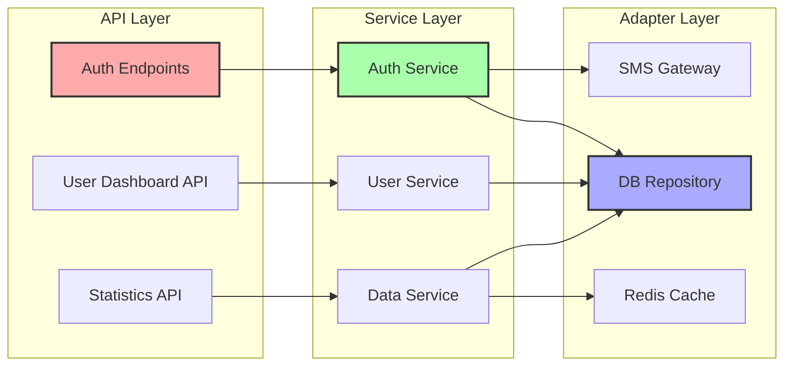

## Data Flow Diagrams

### Main Service Connection Flow (Admin)

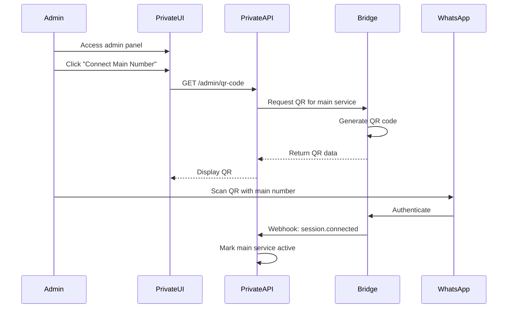

### User Authentication Flow

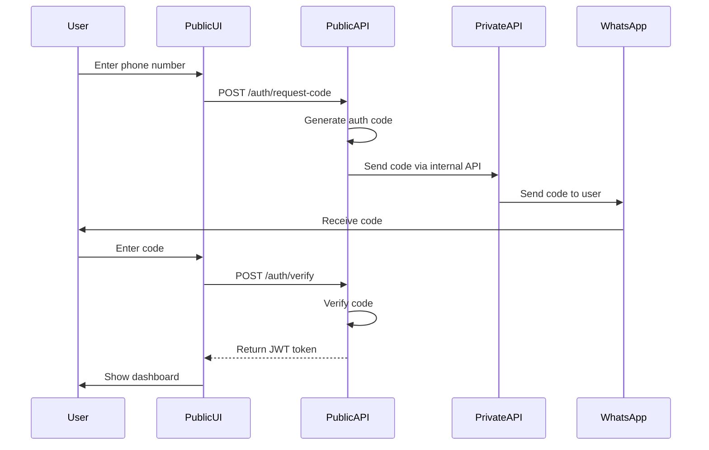

### Message Processing Flow

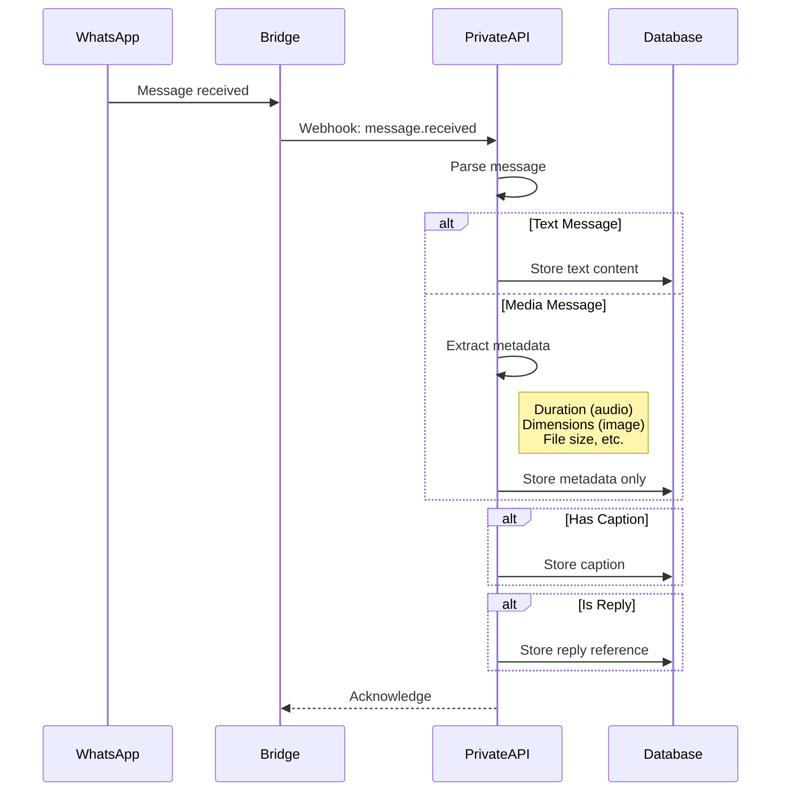

## Database Schema

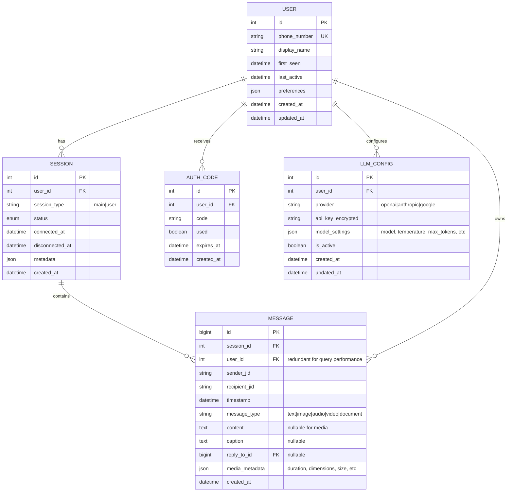

## Technology Stack

### Backend Stack (Both Services)
- **Framework**: FastAPI (Python 3.10+)
- **ORM**: SQLAlchemy 2.0
- **Database**: PostgreSQL 15
- **Cache**: Redis 7
- **Package Manager**: UV
- **Testing**: Pytest + pytest-asyncio
- **Migration**: Alembic
- **LLM Providers**: OpenAI, Anthropic, Google (Gemini)

### Frontend Stack
- **Framework**: Vue 3 (Composition API)
- **Language**: TypeScript
- **Styling**: Tailwind CSS
- **Build Tool**: Vite
- **State Management**: Pinia
- **Router**: Vue Router 4
- **HTTP Client**: Axios
- **Testing**: Vitest + Vue Test Utils

### Infrastructure
- **Containerization**: Docker + Docker Compose
- **Web Server**: Nginx (frontend serving)
- **Process Manager**: Uvicorn (backend)
- **CI/CD**: GitHub Actions
- **WhatsApp Bridge**: zapw (Baileys-based)

## Security Architecture

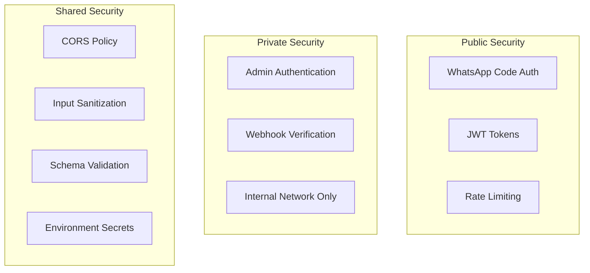

## Deployment Architecture

### Development Environment

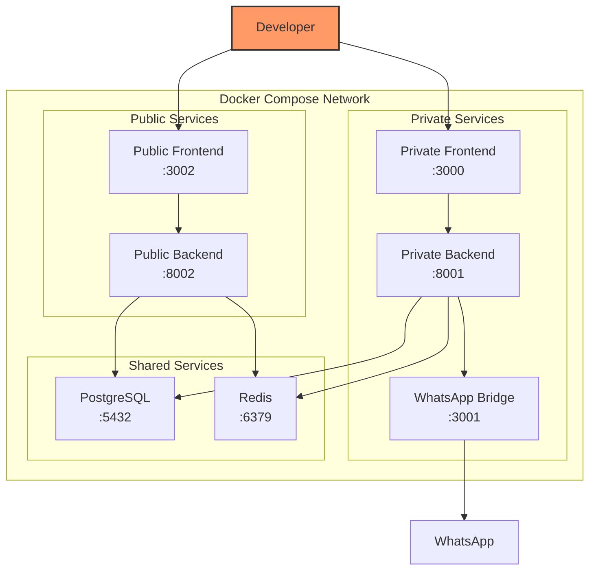

### Production Environment

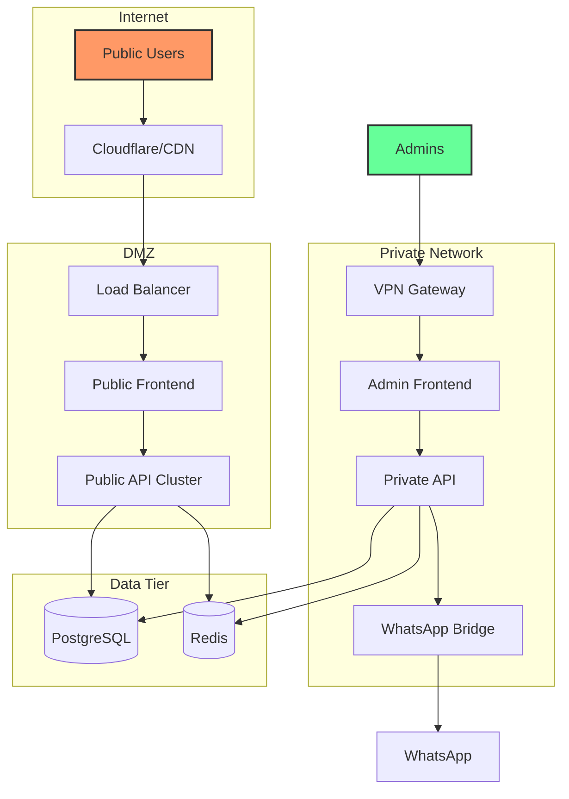

## LLM Provider Architecture

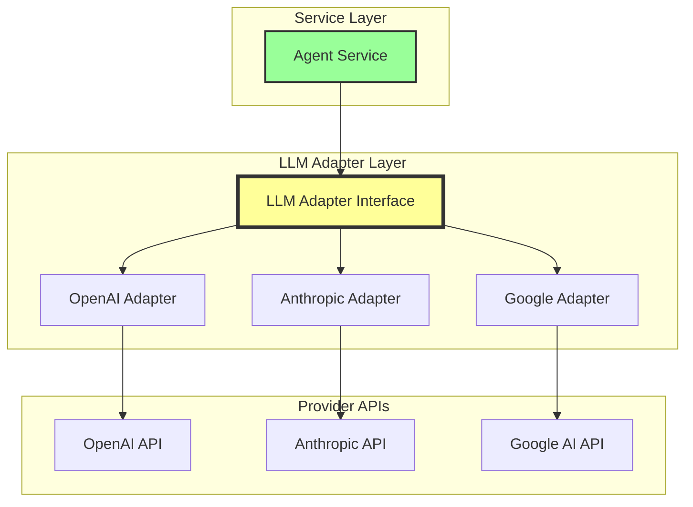

### LLM Adapter Interface
```python
class LLMAdapter(ABC):
    @abstractmethod
    async def complete(self, messages: List[Message], **kwargs) -> str:
        """Generate completion from messages"""
        pass
    
    @abstractmethod
    async def complete_with_functions(
        self, 
        messages: List[Message], 
        functions: List[FunctionDef],
        **kwargs
    ) -> Union[str, FunctionCall]:
        """Generate completion with function calling support"""
        pass
```

## Key Design Decisions

### 1. Separated Public/Private Services
- **Private Service**: Handles webhooks, admin functions, WhatsApp bridge
- **Public Service**: User-facing, authentication, data viewing
- **Security**: Private service never exposed to internet

### 2. WhatsApp-Based Authentication
- Users authenticate via WhatsApp code sent from main number
- No passwords needed - WhatsApp number is the identity
- Codes expire after short time for security

### 3. Efficient Message Storage
- Text messages stored directly in database
- Media messages store only metadata (no large objects)
- Metadata in JSON column for flexibility
- Separate columns for universal fields (timestamp, sender, caption, reply reference)

### 4. Vue.js + Tailwind Frontend
- Shared component library between public and private frontends
- Tailwind for consistent, utility-first styling
- TypeScript for type safety

### 5. Main Service Pattern
- Single main WhatsApp number acts as the service
- Admin connects this number via QR code in private interface
- All user authentication codes sent from this number

### 6. Multi-Provider LLM Support
- Users can choose between OpenAI, Anthropic, or Google as their LLM provider
- API keys stored encrypted in database per user
- Unified adapter interface allows seamless provider switching
- Each provider's specific features (function calling, tokens, models) normalized through adapters

## Message Storage Strategy

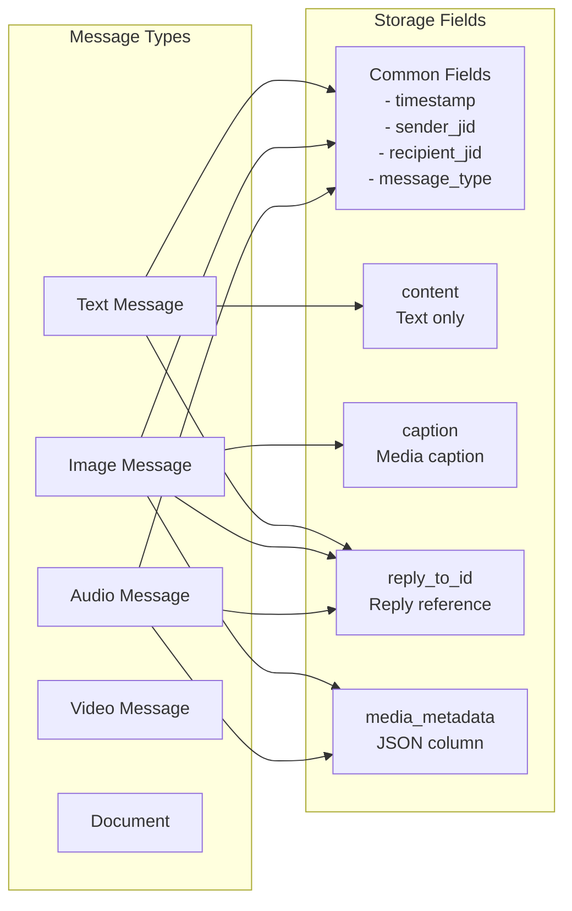

### Media Metadata Example
```json
{
  "duration": 120,
  "size": 1048576,
  "dimensions": {
    "width": 1920,
    "height": 1080
  },
  "mime_type": "image/jpeg"
}
```

## Scalability Considerations

1. **Service Separation**: Public and private services scale independently
2. **Stateless Design**: Both FastAPI services are stateless
3. **Database Optimization**: Indexes on phone_number, timestamp, sender_jid
4. **Caching Strategy**: Redis for auth codes and user session data
5. **Message Partitioning**: Can partition messages table by date if needed

## Monitoring and Observability

- **Health Endpoints**: Both services expose `/health`
- **Webhook Monitoring**: Track webhook delivery success
- **Auth Monitoring**: Track authentication attempts and failures
- **Message Stats**: Count messages per user, types, etc.
- **Connection Monitoring**: Track WhatsApp connection status