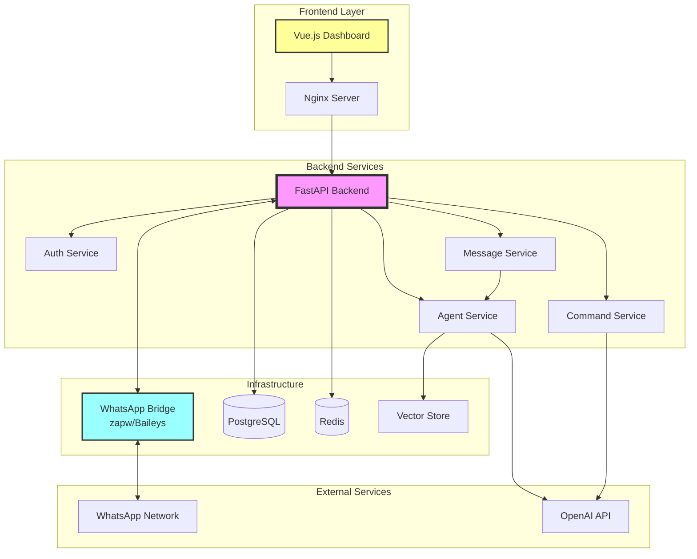
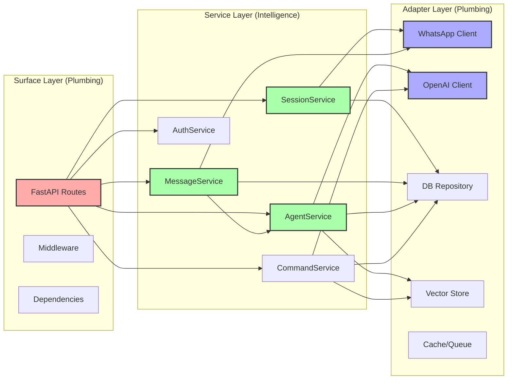
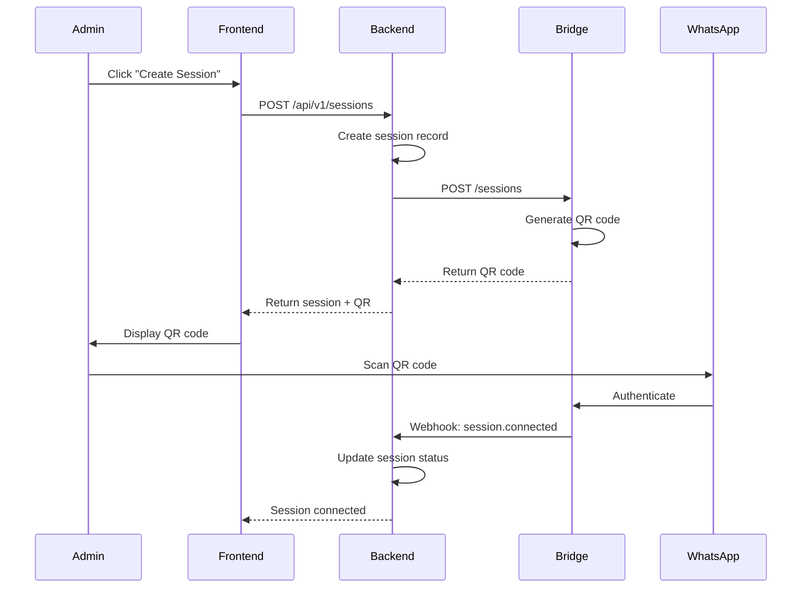
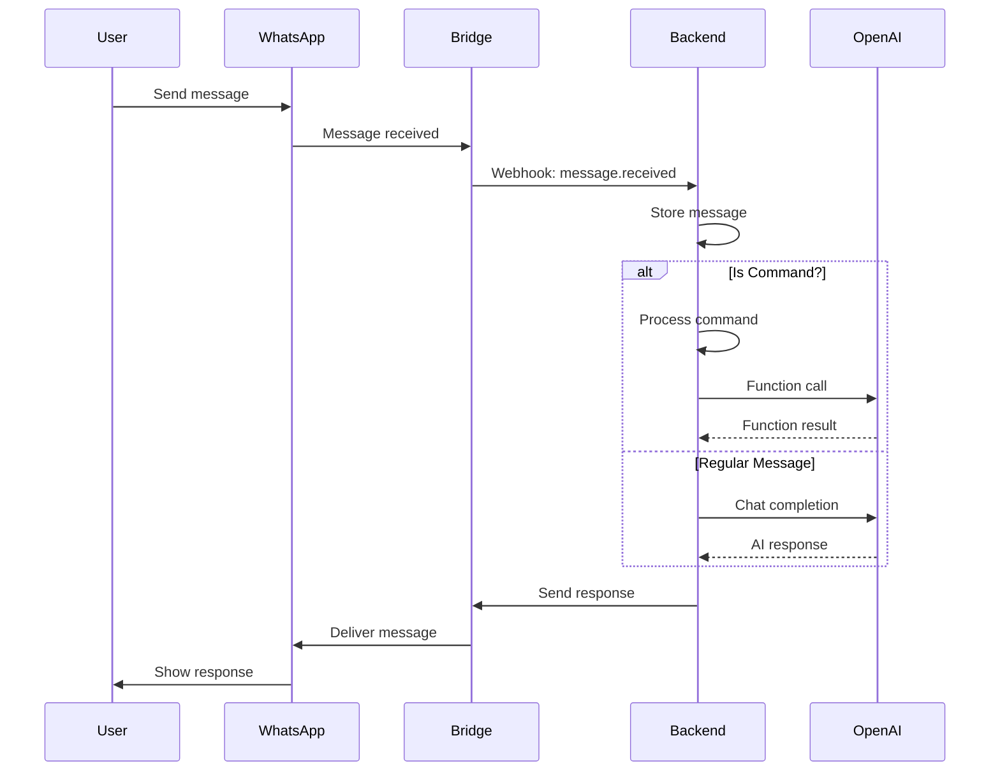
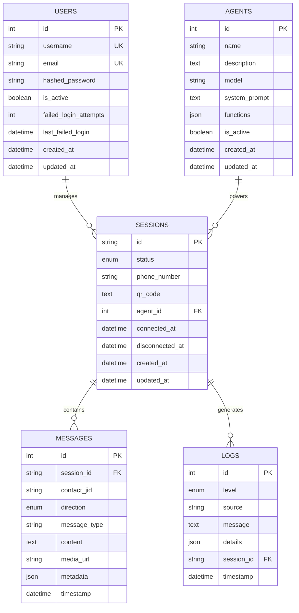
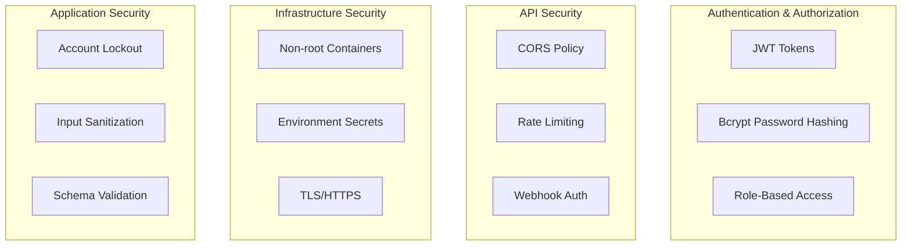
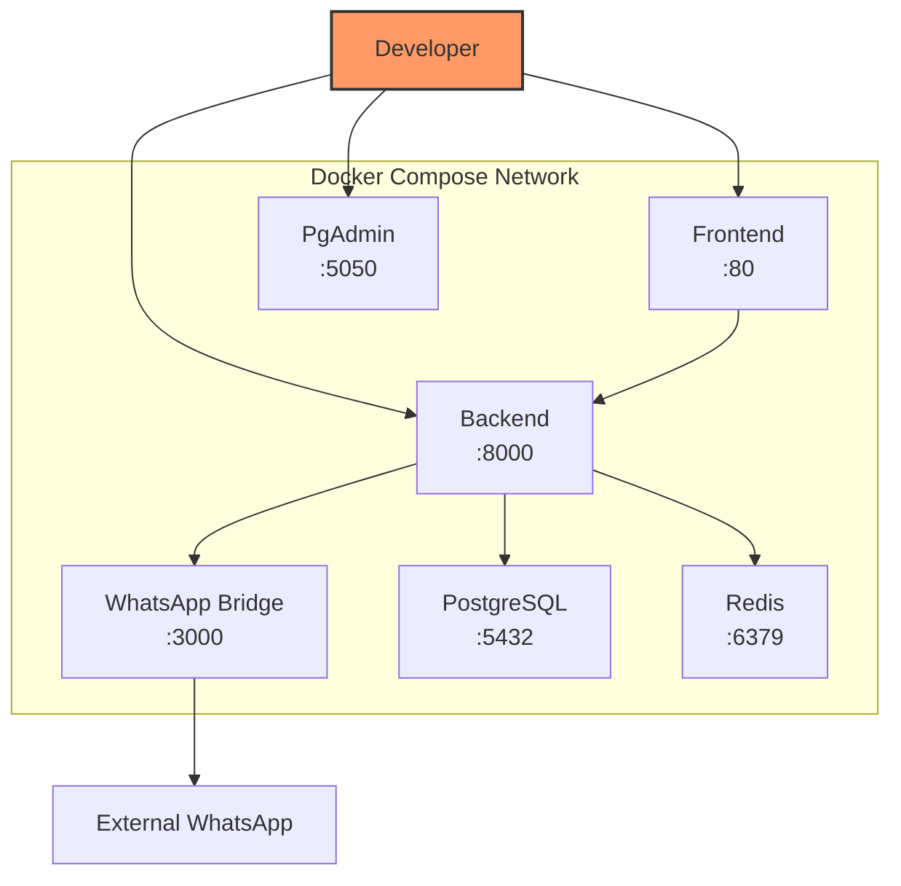
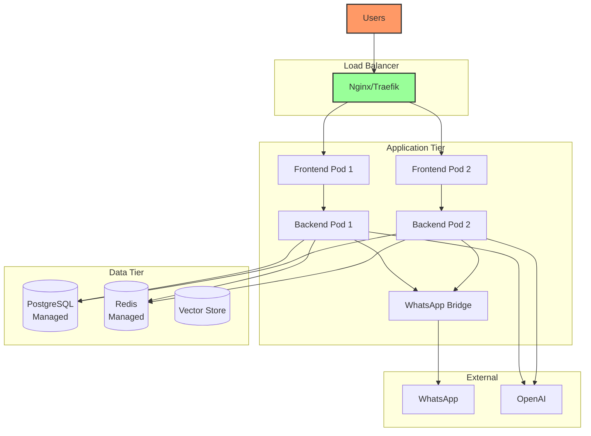

# WhatsApp Agent System Architecture

## Overview

The WhatsApp Agent System is a microservices-based platform that enables businesses to deploy AI-powered agents for WhatsApp conversations. The system follows a **"Plumbing + Intelligence"** architecture pattern, strictly separating infrastructure concerns from business logic.

## System Architecture

## Component Architecture

### Backend Layer Architecture

## Data Flow Diagrams

### Session Creation Flow

### Message Processing Flow

## Database Schema

## Technology Stack

### Backend Stack
- **Framework**: FastAPI (Python 3.10+)
- **ORM**: SQLAlchemy 2.0
- **Database**: PostgreSQL 15
- **Cache/Queue**: Redis 7 (optional)
- **Package Manager**: UV
- **Testing**: Pytest + pytest-asyncio
- **Migration**: Alembic

### Frontend Stack
- **Framework**: Vue 3 (Composition API)
- **Language**: TypeScript
- **Build Tool**: Vite
- **State Management**: Pinia
- **Router**: Vue Router 4
- **HTTP Client**: Axios
- **Testing**: Vitest + Vue Test Utils
- **UI Components**: Custom components

### Infrastructure
- **Containerization**: Docker + Docker Compose
- **Web Server**: Nginx (frontend)
- **Process Manager**: Uvicorn (backend)
- **CI/CD**: GitHub Actions
- **Monitoring**: Health checks + custom monitoring service

## Security Architecture

## Deployment Architecture

### Development Environment

### Production Environment

## Key Design Decisions

### 1. Plumbing + Intelligence Separation
- **Surface Layer**: Handles HTTP, authentication, validation
- **Service Layer**: Contains all business logic and orchestration
- **Adapter Layer**: Isolates external dependencies

### 2. Asynchronous Architecture
- FastAPI with async/await for high concurrency
- Background tasks for heavy operations
- Webhook-based communication with WhatsApp Bridge

### 3. Modular AI Integration
- Configurable agents with different models and prompts
- Function calling for advanced commands
- Vector store for semantic search capabilities

### 4. Resilient Design
- Health checks for all services
- Automatic reconnection for WhatsApp sessions
- Session persistence across restarts
- Comprehensive error handling and logging

### 5. Test-Driven Development
- Unit tests for all components
- Integration tests for APIs
- Mock adapters for external services
- Minimum 80% code coverage requirement

## Scalability Considerations

1. **Horizontal Scaling**: Backend and frontend can scale independently
2. **Session Affinity**: WhatsApp sessions tied to specific bridge instances
3. **Database Pooling**: Connection pooling for PostgreSQL
4. **Caching Strategy**: Redis for frequently accessed data
5. **Queue Processing**: Background tasks via Redis/RabbitMQ

## Monitoring and Observability

- **Health Endpoints**: All services expose `/health`
- **Structured Logging**: JSON logs with correlation IDs
- **Metrics**: Response times, error rates, session counts
- **Alerts**: Failed health checks, high error rates
- **Audit Trail**: All admin actions and AI interactions logged